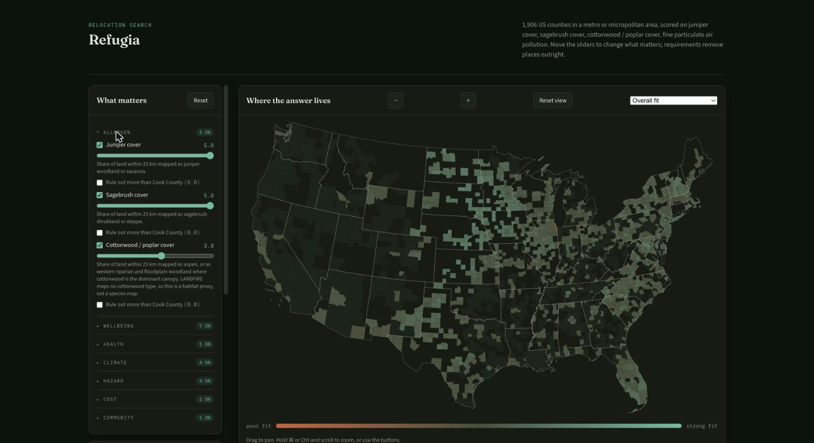
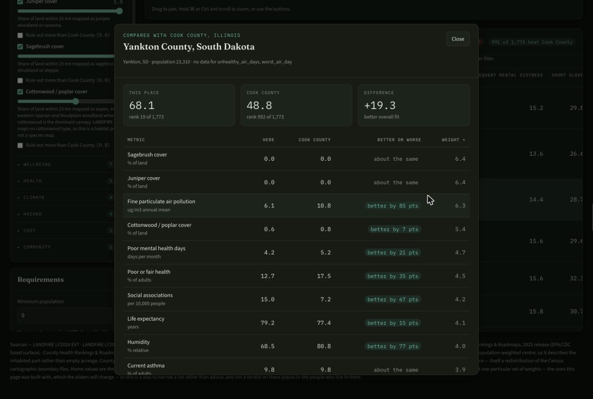

# refugia

Ranks US counties as places to live against a personal profile of allergens,
wellbeing, hazard and cost.

_Refugia_ is the ecological term for the pockets where a species persists through
conditions that eliminated it everywhere else. That is the search.

A personal project, published because it may be useful. US counties only, and the
map is CONUS-only because the vegetation layer is. Pre-1.0: the profile format and
the saved dataset are both things you might depend on, and neither is frozen —
`CHANGELOG.md` records what moves. Issues and pull requests are welcome,
`CONTRIBUTING.md` says how, and there is no support promise.

## The answer is a page, not a table

`refugia publish` writes one self-contained HTML file. The ranking is not baked
into it — the page carries the whole dataset and re-scores in the browser, so the
sliders re-rank as you move them and the map reshades on whichever metric you
pick.



Weights reorder; requirements remove. "Nowhere with more juniper than I already
have" is not a preference you can express by weighting, so each metric carries its
own cut, measured against where you live now.

Click any county and it is compared with home, metric by metric, ordered by how
much each one actually moved the score rather than by the size of the raw gap.



One file, no server, works offline. You can hand it to someone else and they can
re-weight it to their own priorities without installing anything.

> These are county-wide figures, and several are modelled estimates rather than
> direct measurements. They are ranked against weights you choose, which makes
> this a way to narrow a list — not advice, and not a verdict on these places or
> the people who live in them.

[Using the page](docs/guide/using-the-page.md) covers the rest: requirements
against home, the map's metric selector, the city panel, the keyboard route, and
where saved setups live.

## Why it works the way it does

**Allergen exposure is structural, not forecast.** Pollen APIs answer "should I go
outside on Thursday". A relocation decision needs "how much of this plant grows
where I would live, every spring, for as long as I live there". So the allergen
metrics are land-cover fractions from LANDFIRE, sampled in a radius around each
county's _population-weighted_ centre — the area centroid of a large western county
sits in rangeland nobody lives in.

**The happiness index everyone cites no longer exists, and its replacements are
worse than they look.** The Gallup-Sharecare Community Well-Being Index last
published metro rankings in 2020 and was never machine-readable. Social-media
derived indexes cover every county and are tempting, but they measure curated
public expression rather than residents' experience, and attribute posts to where
they were sent rather than where the sender lives.

So wellbeing here comes from things that actually ask residents about themselves:
CDC PLACES (depression, frequent mental distress, short sleep) and County Health
Rankings (self-rated poor or fair health, poor mental health days, life
expectancy), plus Social Associations as the administrative proxy for organised
social life. They stay separate and weightable rather than pre-combined, because a
score whose weights you cannot see or change is a black box.

**Filters and weights are different mechanisms.** A weight says "this matters"; a
filter says "without this, nothing else matters". Folding a disqualifier into a
weight lets a place win on everything else and surface anyway.

**Normalisation is percentile rank, after filtering.** Several metrics have extreme
tails — one county with catastrophic smoke would compress every other county into
the top few percent of a min-max scale, exactly where the real candidates are.

**A place missing data is not ranked as though the data were good.** Weights are
renormalised over the metrics a place actually has, which quietly rewards it for
the absence: a county outside the vegetation layer would otherwise top an allergen
search precisely because its allergen data is unknown. `min_coverage` (default 0.8)
drops those rows, and the page shows a Data column so a partial row is visible.

## Install

Python 3.12 or newer, and [uv](https://docs.astral.sh/uv/).

```bash
git clone https://github.com/krimsonkla/refugia && cd refugia
uv sync --all-groups
```

That is the whole install. `uv` builds the environment from the committed
`uv.lock` and puts the `refugia` command in it; prefix commands with `uv run`, or
activate the venv once and drop the prefix. No API keys, accounts or registrations
are needed for any data source.

There is also a `devenv.nix` for [devenv.sh](https://devenv.sh), which pins the
interpreter and installs the git hooks. It is a maintainer convenience rather than
a requirement — nothing here needs nix, and the test suite runs identically either
way.

## Use

Full walkthroughs live in **[the guide](docs/guide/)**. The short version:

```bash
uv run refugia fetch                                      # download everything (slow, cached)
uv run refugia rank --profile profiles/example.json --top 20 --explain
uv run refugia publish --profile profiles/example.json    # writes out/refugia.html
uv run refugia ask "cheapest places with almost no juniper"
```

`fetch` is slow and network-bound; everything else reads the saved dataset, so
re-weighting costs nothing. Copy `profiles/example.json` and edit it — the weights
are yours, and that is the point.

`--explain` breaks a place's score into what actually produced it:

```
  #  place                                         score  cover
  1  Lincoln County, South Dakota                   69.2    90%
       populus_cover          +  6.4   raw=0.2
       juniper_cover          +  6.3   raw=0.0
       sagebrush_cover        +  6.3   raw=0.0
       air_pollution          +  6.2   raw=6.5
       poor_mental_health_days +  4.8   raw=3.5
       life_expectancy        +  4.7   raw=83.8
       ...
```

Read down the contributions and you can see whether a result is real or one metric
doing all the work.

Every option and default, and what a cold fetch costs on disk, is in [the
command line](docs/guide/command-line.md).

## Reading the output

The score is a **percentile position among the places that survived your filters**,
not a measurement — so it is not comparable between two profiles, nor to itself
after you change a requirement. [Reading the
numbers](docs/guide/reading-the-numbers.md) explains that, the coverage column, and
how to tell how old a page's data is.

## Writing a profile

A profile is the whole of your preference, as data: which metrics matter and how
much, and what disqualifies a place outright. `profiles/example.json` is a working
one to copy, and `refugia metrics` prints the vocabulary it is written against.

The full schema — weights, requirements, normalisation, coverage, home — is in
[writing a profile](docs/guide/writing-a-profile.md).

## Two grains

Most of what is measured is published per county, and the ranking is a county
ranking. Two things are measurable per city without a new kind of source, and the
city panel uses them:

- **Land cover.** The vegetation sample was always a radius around a point, so a
  city is the same question asked at a sharper coordinate. It moves the answer:
  inside one interior-west county the sagebrush share runs from 5.5% around its
  smallest town to 21% around its largest, and the county figure of 24.7%
  describes neither.
- **Health estimates.** CDC PLACES publishes a place release as well as a county
  one, keyed by the same place GEOID the map markers already carry, and it
  carries two measures the county release does not: self-rated health and social
  isolation.

Everything else stays county-level, including the particulate reading and every
County Health Rankings measure. The city panel marks each row `city` or `county`
rather than presenting the mixture as though it were uniform, because a county
figure is identical for every town in it and saying so is the difference between
a measurement and a repetition.

## Adding a metric

Three tiers, in increasing order of what they can express and of what they cost.

1. **A metric already registered needs no work to visualise.** The page builds its
   sliders, table columns and map layers from the registry. Nothing is hard-coded
   per metric.
2. **A tabular source is a JSON spec** — no code at all.
   See [adding a metric with a spec](docs/guide/adding-a-spec.md).
3. **A source needing real logic is a written adapter**, and owes tests.
   See [adding a metric with an adapter](docs/guide/adding-an-adapter.md).

**Every new source is judged on coverage.** `fetch` flags any metric below 75%,
because the characteristic failure of a data source is not an error — it is a tidy
set of plausible numbers for the places it reached and silence for the rest.

## Asking questions

Two front ends, because a published page cannot reach a machine on your desk.

**In the page**, but only where a host offers a model. Nothing is declared at build
time — `publish` substitutes the data into the template and writes a file. The page
asks at runtime: it looks for `window.claude.use`, and if that exists it requests
the `sample` capability. Granted, the Ask panel appears and the viewer's questions
run on their own account, under whatever the host asks them to agree to. Declined,
or opened from disk, or served from anywhere else — the panel stays hidden and the
rest of the page behaves exactly as it does anywhere.

Where it is available, the model is not handed a summary — it is given _functions_
over the live view (`list_states`, `explain_subset`, `top_places`, `compare_places`)
and told to call them and never do arithmetic itself.

That distinction is the design. A precomputed summary can only answer the question
it was built for, and the next question has a different shape: "what drives the west
coast" wants weighted deficits by region, "what would I give up in the mountain west"
wants a trade-off between two subsets, "which cheap places have low juniper" wants a
filtered ranking. Anticipating one means failing the rest.

`explain_subset` returns `weighted_deficit` — the gap from the national mean times
the metric's share of the score — and the model is told to rank on that, not on the
raw gap. Handed raw gaps, a model will name a metric that is severe in one state and
near average in its neighbours and call it a shared cause. The weighting is what
makes the answer correct rather than merely plausible.

The page reaches the model only when the viewer asks it to — typing a question, or
pressing "Summarise this comparison". Acquiring the capability is not using it, and
nothing is sent on load. Whether the viewer is prompted first, and on whose account
the usage lands, is the host's to decide; the page only asks, and handles being
told no.

**On the command line.** `refugia ask` uses a local Ollama model as a _query
planner_ rather than an analyst: it converts a question into a scoring profile, the
deterministic engine ranks, and the model then narrates rows it has been handed. It
never holds the numbers it would otherwise be tempted to invent. Default
`qwen3:30b-a3b` — a mixture-of-experts model, so only ~3B parameters are active per
token: 30B-class quality at speed in about 18GB. Override with `--model`.

This is the one part of refugia with a prerequisite outside `uv sync`. It needs
[Ollama](https://ollama.com) installed and running, and the model pulled:

```bash
ollama serve
ollama pull qwen3:30b-a3b        # about 18 GB
uv run refugia ask "cheapest places with almost no juniper"
```

Everything else — `fetch`, `rank`, `publish` — works without it. By default the
model runs on your own machine against a dataset already on disk, so the question
and the rows never leave it; `--host` will point at another Ollama instance if you
want it to, and then they do.

## Known gaps

- **Air quality stands in for wildfire smoke.** The smoke-specific county dataset
  (Stanford ECHO, on Harvard Dataverse) was unreachable throughout the build, and
  the better-resolved alternative (Dryad, 2006-2025) is 5.7GB of gridded rasters.
  What is carried instead is `air_pollution` — annual mean PM2.5 from the modelled
  surface, at 95% coverage — plus `unhealthy_air_days` and `worst_air_day` from the
  EPA's county AQI summaries, which are the episodic half a mean averages away.
  The pair works: one interior-west county reads 15.8 ug/m3 against a national
  median of 7.6, which is the smoke season showing through.
- **`populus_cover` is a habitat proxy.** LANDFIRE maps no cottonwood type;
  cottonwood sits inside generic riparian classes. The metric combines aspen
  classes with western riparian and floodplain woodland where cottonwood dominates.
- **Scoring is implemented twice** — Python in `scoring/`, JavaScript in
  `artifact/template.html`, because the sliders re-rank without a round trip and
  the page has no server to ask. `tests/conformance/vectors.json` runs the same
  cases through both and fails the build if they disagree, so the duplication
  remains but the drift does not.
- **The network adapters are thinly tested.** The scoring core, the store and
  the declarative tier are all above 92%; the adapters are the modules whose
  behaviour is defined by an upstream's quirks, and testing them properly means
  recording real payloads as fixtures. The suite runs offline and refuses to
  make a real request, so what is covered is covered honestly.
- Alaska and Hawaii appear in the table but not the map: the vegetation layer is
  CONUS-only.

## Contributing

`CONTRIBUTING.md` has the setup, the checks CI runs, and the conventions that will
get a pull request sent back. `SECURITY.md` describes what this tool actually
trusts — a spec is a network request in data clothing, and every upstream is
untrusted — and how to report something exploitable in private. The most useful contributions are a new metric or a
source that has stopped working — this is a thin layer over ten public datasets,
and those datasets move.

## Data and licence

The code is MIT — see `LICENSE`. The data is not the code's to license: refugia
ships none of it and fetches everything at run time, so each source's own terms
govern what you fetch. `DATA_SOURCES.md` has one entry per publisher, and marks
which positions are verified and which are inferred.

Two matter in practice. **County Health Rankings**, which five metrics draw on,
licenses its content for personal and non-profit use only and requires a specific
citation; commercial use needs their prior written consent. **Zillow** requires
clear attribution. Both citations are in the footer of every page `publish`
writes, along with the ISC notice for the county outlines.

One thing the page does that a self-contained file might not lead you to expect:
it loads its typefaces from Google Fonts, so every viewer's browser contacts
`fonts.googleapis.com`. Nothing about the viewer or the data is sent — it is a
request for a font file — but it is a third party, and offline the page falls back
to system faces and works unchanged.

That footer matters because a published page embeds the values for every county it
ranks. Running the tool is not redistribution; sharing the page is, and the same
terms travel with it. So does the profile it was built from — including your home
county, if you set one — so a page is a statement about your preferences as well as
about the places. `publish` says as much when it writes one.
